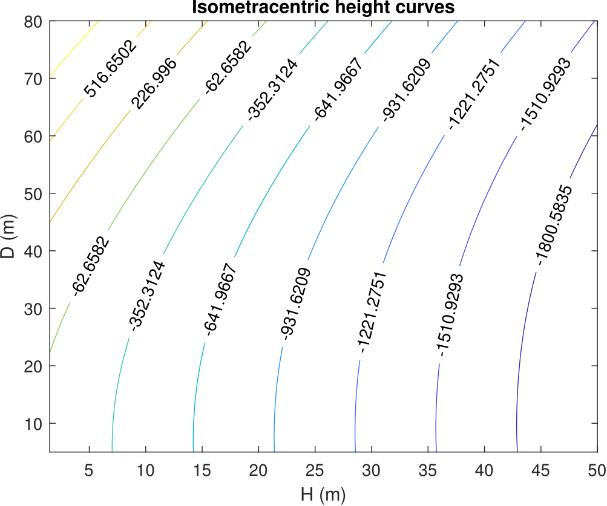
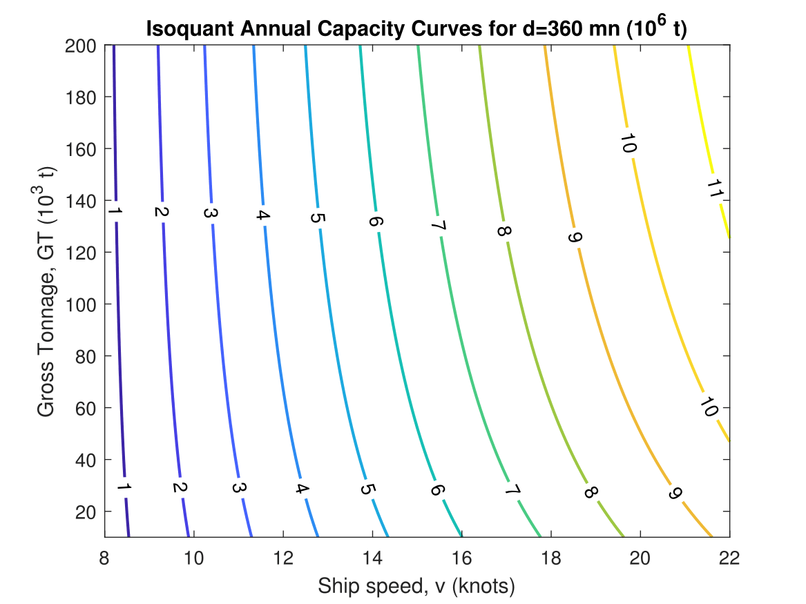
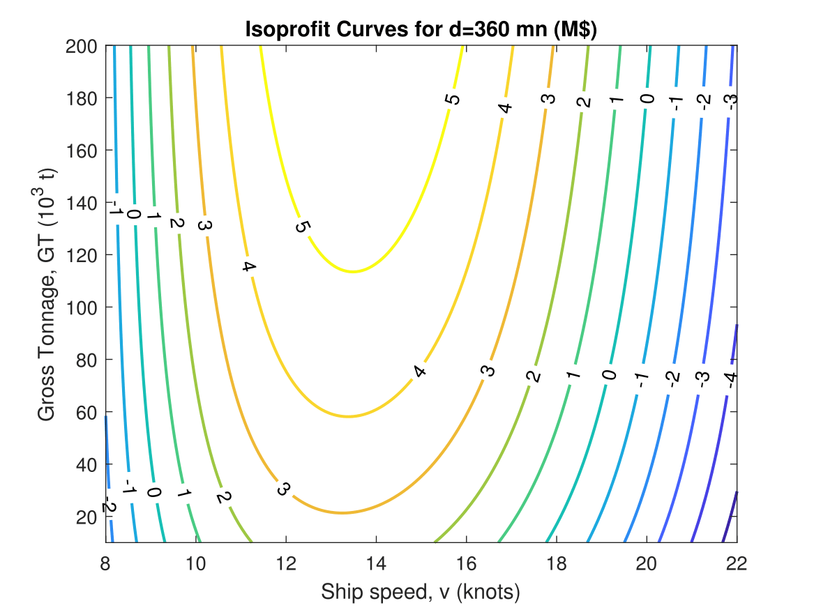

# Plantilla TFG/TFM de la ETSIN-UPM
Plantilla en LaTeX para el Trabajo de Fin de Grado (TFG) o Trabajo de Fin de Máster (TFM) de la Escuela Técnica Superior de Ingenieros Navales de la Universidad Politécnica de Madrid (ETSIN-UPM). Contiene la estructura básica para la memoria del mismo, siguiendo la [plantilla  en Microsoft Word](http://www.etsin.upm.es/Escuela/Estudios/Master/Master_en_Ingenieria_Naval_y_Oceanica?prefmt=articulo&fmt=detail&id=4ca686862ecd0510VgnVCM10000009c7648a____) propuesta.

## Autor
Este proyecto ha sido desarrollado por Ricardo López García ([@ricardolopezgr](https://github.com/ricardolopezgr)).

## Licencia
El código fuente se ha publicado bajo la [licencia MIT](https://github.com/ricardolopezgr/TFG-TFM-template/blob/master/LICENSE).  Los logos utilizados pertenecen a la [Escuela Técnica Superior de Ingenieros Navales](http://www.etsin.upm.es/) de la [Universidad Politécnica de Madrid](http://www.upm.es/).

## Contribuir
Si encuentras algún error o posible mejora no dudes en abrir una `Issue` o `Pull Request`.

## Estilo del texto

En este capítulo se presenta el estilo general del texto que se
desarrollará en formato de página A4. Se ha optado por un estilo
Helvetica 11 pt (pudiendo optar por 12pt) a elección. Los
márgenes recomendados son: superior 3 cm, inferior 1.5 cm, izquierdo 3
cm, derecho 1.75 cm.

Esta plantilla de LaTeX comienza cada capítulo en página impar y
deja, si es necesario, la página anterior vacía.

Pueden desarrollarse los contenidos con distintos subapartados. Se trata
en este documento de mostrar el formato elegido.

### El texto

Se han de escribir las principales ideas, métodos, elementos de cálculo
y de diseño utilizados. Recuerde que el número de páginas es limitado.

#### Secciones y sub-secciones

No conviene expandir más del nivel de sub-sección la estructura del
texto.

### Los elementos gráficos

En este documento sólo se ofrece formato a las figuras y tablas.

#### Figuras

Las figuras se numeran automáticamente con el número de capítulo seguida
del número de figura en orden creciente. Su título está centrado y
debajo de la figura.

Se recomienda que las figuras vayan situadas adecuadamente en el texto.
Recuerde que prioritariamente las figuras deben situarse en la parte
alta de cada página. Sirva el siguiente ejemplo para ilustrar el formato
de las figuras:
```TeX
    \begin{figure}[H]
        \centering
        \includegraphics[width=0.8\textwidth]{images/figure_1.eps}
        \caption{La primera figura}
        \label{fig: isom}
    \end{figure}
 ```
<p align="center">

</p>
Recuerde insertar gráficas de alta calidad y a ser posible que se contraste bien lo que se quiere mostrar. No todos los documentos son impresos en color pese a las muy altas prestaciones gráficas de hoy en día.


Para colocar varias gráficas, se recurre al entorno `minipage`.
```TeX
\begin{minipage}{0.5\textwidth}	
	\begin{figure}[H] 
		\includegraphics[width=1.00 \textwidth]{images/minipage1.eps}
		\caption{La segunda figura}
		\label{fig: minip}
	\end{figure}	
\end{minipage} \hfill \begin{minipage}{0.5\textwidth}	  
	\begin{figure}[H] 
		\includegraphics[width=1.00 \textwidth]{images/minipage2.eps}
		\caption{La tercera figura}
		\label{fig: minip2}
	\end{figure}
\end{minipage}
```
  


Se recuerda que ambas gráficas deben estar muy relacionadas para
mostrarse juntas.

### Tablas

Las tablas se numeran también con el número del capítulo seguido del
número de tabla en orden creciente. El título está centrado y en la
parte superior de la tabla.

Se recomienda que las tablas tengan información concisa y bien
estructurada. Sirva el siguiente ejemplo para ilustrar el formato de las
tablas:
```TeX
 % Table generated by Excel2LaTeX from sheet 'Hoja1'
    \begin{table}[H]
    \centering
    \caption{Principales valores}
    \begin{tabular}{lrr}
        \toprule
        Variable   & Valor &   Unidad \\ \midrule
        Potencia   &   1.2 &       MW \\
        Velocidad  &   2.3 &      m/s \\
        Impedancia &   0.3 & $\Omega$ \\ \bottomrule
    \end{tabular}%
    \label{tab: valores}%
    \end{table}%
```
Que produce un resultado similar a éste:
<p align="center">

| Variable   | Valor |     Unidad |
| :--------- | ----: | ---------: |
| Potencia   |   1.2 |         MW |
| Velocidad  |   2.3 |        m/s |
| Impedancia |   0.3 |           Ω|


</p>

Una opción para realizar tablas es utilizar Excel y después generar el
código mediante la macro
[Excel2LaTeX](https://ctan.org/pkg/excel2latex?lang=en). Existen
opciones similares para LibreOffice.

### Ecuaciones

Para las ecuaciones, se pueden escribir en el modo “en línea” ,
produciendo el siguiente resultado \(c^2=b^2+a^2\) o bien numerándose
para luego ser referenciadas,
como se muestra a continuación.

```TeX
    \begin{equation}
    ISE=\int_{0}^{\infty} \left(\widetilde{f}(\tau)-f(\tau)\right) d\tau
    \label{eq: ISE}
    \end{equation}
```
<p align="center">
<a href="https://www.codecogs.com/eqnedit.php?latex=ISE=\int_{0}^{\infty}&space;\left(\widetilde{f}(\tau)-f(\tau)\right)&space;d\tau" target="_blank"></a>
</p> 
 
Existen numerosos recursos en línea para editar las ecuaciones
fácilmente. Se recomienda [HostMath](http://www.hostmath.com/).

## Algoritmos

Para la exposición de un algoritmo u otro procedimiento que se requiera
para la puesta en marcha, fabricación, proceso, etc. se puede recurrir
al formato que se encuentra en el Anexo (ver GANXXX.pdf). Nótese
que no se recomienda incluir código de programación o similares en el
cuerpo del documento.

## Otros elementos

Se incluyen aquí otros elementos sujetos a formato como pueden ser los
siguientes.

### Listas enumeradas
Se generan del siguiente modo:
```TeX
\begin{enumerate}
	\item Primer elemento numerado.
	\item Segundo elemento numerado.
	\item ...
	\item hasta el último
\end{enumerate} 
```
Que produce:

1.  Primer elemento numerado.

2.  Segundo elemento numerado.

3.  ...

4.  hasta el último

### Viñetas
Se generan como:
```TeX
\begin{itemize}
	\item Primer elemento numerado.
	\item Segundo elemento numerado.
	\item ...
	\item hasta el último
\end{itemize} 
```
Dando como resultado:

  - Primer elemento numerado.

  - Segundo elemento numerado.

  - ...

  - hasta el último
  
  ## Consejos
Se aprovecha esta sección para dar algunos consejos respecto a la
redacción de textos con LaTeX.

  - La distribución de LaTeX usada en este documento es [MikTeX 2.9](https://miktex.org/). Se
    recomienda usar esta versión frente a LiveTeX para evitar posibles
    errores al compilar.

  - El compilador es el que trae TeXStudio por defecto: pdfLaTeX.

  - Un editor muy usado y disponible en Windows, Mac y Linux es
    [TeXstudio](https://www.texstudio.org/). Facilita ciertas operaciones como crear un `environment`,
    alineación de tablas, etc. A veces es necesario limpiar los archivos
    auxiliares que se generan para que el documento se compile más
    rápido. En TeXstudio, se hace en Tools \> Limpiar archivos
    auxiliares.

  - Este documento ha sido dividido en capítulos, por lo que no será
    necesario compilar todos ellos cuando se esté trabajando en uno.
    Fácilmente se podrá incluir o no el capítulo usando el comando
    `\include{CapituloX}` en la raíz del documento. Los nombres de los
    archivos deben NO incluir espacios.

  - Se deberá hacer referencias a figuras, tablas, ecuaciones o incluso
    apartados durante el documento. Por ello, es recomendable usar el
    comando `\label{eq: deformada}` para asignar una etiqueta al objeto
    a referenciar, mientras que usaremos `\ref{eq: deformada}` para que
    se imprima la referencia. Los prefijos “eq:”, “fig:”, “tab” son muy
    útiles para no confundir referencias.

  - Se pueden incluir pies de página mediante el comando
    `\footnote{Texto que se quiera mostar}` para realizar aclaraciones.

  - Se recuerda que para poner alguna palabra entre comillas se usarán
    dos acentos graves al comienzo de la frase (` `` `) y dos apóstrofos
    al final (`''`).

  - Para realizar una lista de términos y acrónimos (lo cual se
    recomienda), una manera alternativa a `\makeglossary` es incluir un
    capítulo sin numeración debajo de “Agradecimientos” que se llame
    “Términos y Acrónimos” y pegar una tabla sin bordes que se haya
    realizado y ordenado alfabéticamente en un Excel. Sería una tabla de
    dos columnas, con el acrónimo a la izquierda y su definición a la
    derecha.

## Información sobre la bibliografía
Todos los documentos técnicos (Trabajo Fin de Grado, Tesis Doctoral,
Artículo Técnico o Científico, Memoria, etc.) deben incluir una sección
de bibliografía en la cual se hace un listado de todas las fuentes
consultadas para realizar el trabajo. Es preciso otorgar el crédito a
los trabajos realizados por otros y que se utilizan de algún modo u otro
en el trabajo propio. Por esta razón, en el texto se deben incluir las
referencias a las fuentes empleadas intentando incurrir en plagio, aún
cuando ésta no sea nuestra intención. Se citará usando `cite{}` .

Todas las fuentes utilizadas deberían ser referenciadas en nuestro
trabajo. Estas fuentes pueden ser:

  - Un libro o capítulo de libro

  - Un artículo de revista

  - Un artículo de congreso

  - Un manual técnico

  - Un trabajo anterior (Fin de Grado, Fin de Máster, Tesis Doctoral,
    etc.)

  - Un enlace virtual (Wikipedia, etc.)
  
 Se recomienda usar para la bibliografía programas como [JabRef](http://www.jabref.org/JabRef) o
[BibTex](http://www.bibtex.org/) para gestionar las referencias. El estilo más extendido en
publicaciones es el IEEEtran, que en LaTeX se denomina `ieeetr`.
Aparecen listados los trabajos a medida que se van citando, tal y como
se puede comprobar  en la siguiente página. Con este tipo de
bibliografía, no aparecerán los trabajos hasta que éstos sean citados.

El siguiente código genera la bibliografía (incluido en el archivo GANXXX.tex)

```TeX 
    \bibliographystyle{ieeetr}
    \addcontentsline{toc}{chapter}{\bibname}
    \bibliography{refsreal}  
```
